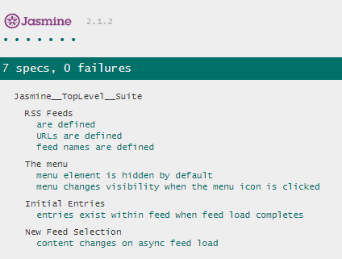

# Jasmine framework based testing project

Using jasmine testing framework to test an RSS feed reader app.

Tests are independent and test function of the app e.g. that entries exist, that feed loading occurs, that elements are hidden when they should be.

## getting started
clone the project  with `git clone <insert url here>` and open index.html in a browser (try chrome if possible), then observe the jasmine test output at the bottom of the page

## made with
* [Jasmine](http://jasmine.github.io/) - testing framework

## Why testing?
see - http://github.com/udacity/frontend-nanodegree-feedreader

standard of development known as "test-driven development": write tests first, before start development of application. All the tests initially fail and then start writing application code to make these tests pass.

## Also see: 
See [Project Rubric](https://review.udacity.com/#!/projects/3442558598/rubric)

1. Udacity JavaScript Testing [course](https://www.udacity.com/course/ud549)
2. The [required project assets](http://github.com/udacity/frontend-nanodegree-feedreader).

### acknowledgements

* Udacity course and people! see https://eu.udacity.com/course/front-end-web-developer-nanodegree--nd001

## project preview:

app screens:

